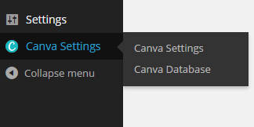
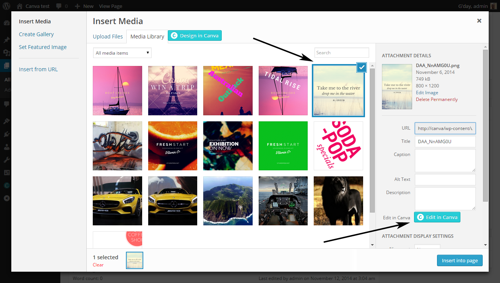
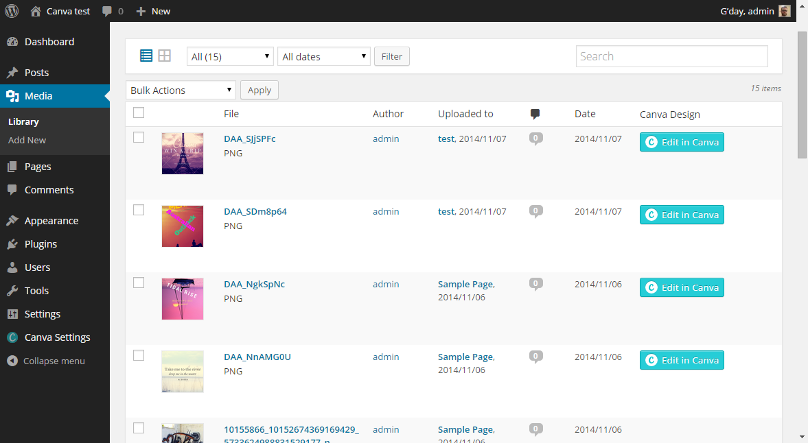
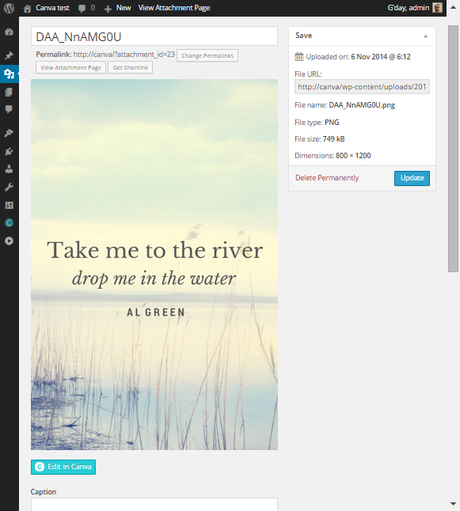

Canva Wordpress Plugin
======================

Originally written by Ash Durham (http://durham.net.au)

Updated and modified by Justin King (http://getafixx.com)

Plugin Name: Canva
Version: 1.2.4
Plugin URI: [https://www.canva.com ]https://www.canva.com
Description: Utilise the full features of Canva directly in the edit screen of a page, post and custom post type, as well as within the canva database page and media library.
Author: Canva
Author URI: https://www.canva.com
Text Domain: canva
Domain Path: /languages/
License: GPL v3

Canva Wordpress Plugin
Copyright (C) 2016, Canva - info@canva.com, support+wp@canva.com

## About

Utilise the full features of Canva directly in the edit screen of a page, post
and custom post type, as well as within the canva database page and media library.

## Installation - To be completed ...
If you are reading this file, you most likely have downloaded a zip file from Canva or the wordpress plugin repository.

To install simply unzip the folder into your wordpress wp-content/plugins directory and then in the wp-admin -> plugins menu
find the "Canva" entry and click the activate link.

If this is unfamiliar, we suggest you use [this helpful guide from wpbeginner.com](http://www.wpbeginner.com/beginners-guide/step-by-step-guide-to-install-a-wordpress-plugin-for-beginners/) to help you through your install.

If you see the "canva settings" menu with the canva 'C' as it's menu icon, the plugin has installed correctly.

### New Designs

While in a post or page editing window, you should notice that on the top left hand corner of the content editor
is a button.

You can create a new blog graphic by clicking the Canva Design Button while adding or editing a post in WordPress

Design your blog graphic in Canva without leaving your WordPress page, giving you access to millions of layouts and images

When you're finished your new design automatically gets added to your post

Publish your post and your new blog graphic goes live on your site!

Your new design will be automatically added to the canva database.

### Editing Canva Designs

There are several ways you can achieve this

#### 1. With in a post or a page
   If you have used the design in canva button OR the wordpress media library to insert a canva design
into your content you can select the canva design in the visual tab of the content editor
Up in the top left hand corner next to the edit and delete icons, the Canva "C" icon will also show.

if you click this you will be able to edit your canva design, and after publishing your updated
canva design will be in the shown in the content window.

#### 2. Within the Media library with in a post
   By clicking on the insert media button in a post or a page, you can also "edit" any image with the wordpress media library. Again there are several places you can do this.
   By clicking on a Canva Design in the initial insert media window, on the right hand side bar, where the attachment details are shown, there is will be an "edit with canva" button

  

#### 3. Within the Media library from the Admin menu
   1 -  Within the main media library window, you there will be a new row that you can edit any canva design.

   2 -  Within the Edit window of a single image within the Media Library.

#### 3. Within Canva Settings -> Canva Database page
  A list of all the Canva Designs that have been created without the clutter of other media library items

